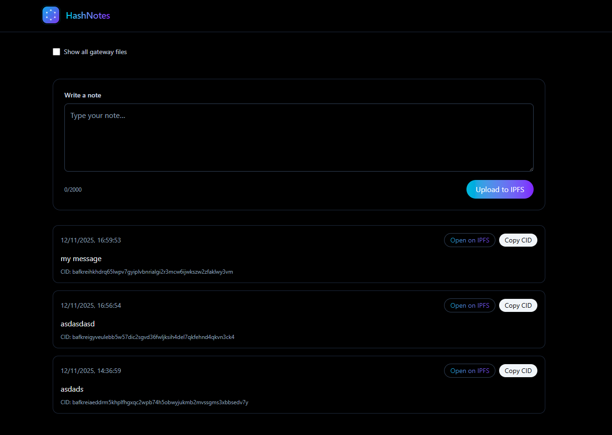
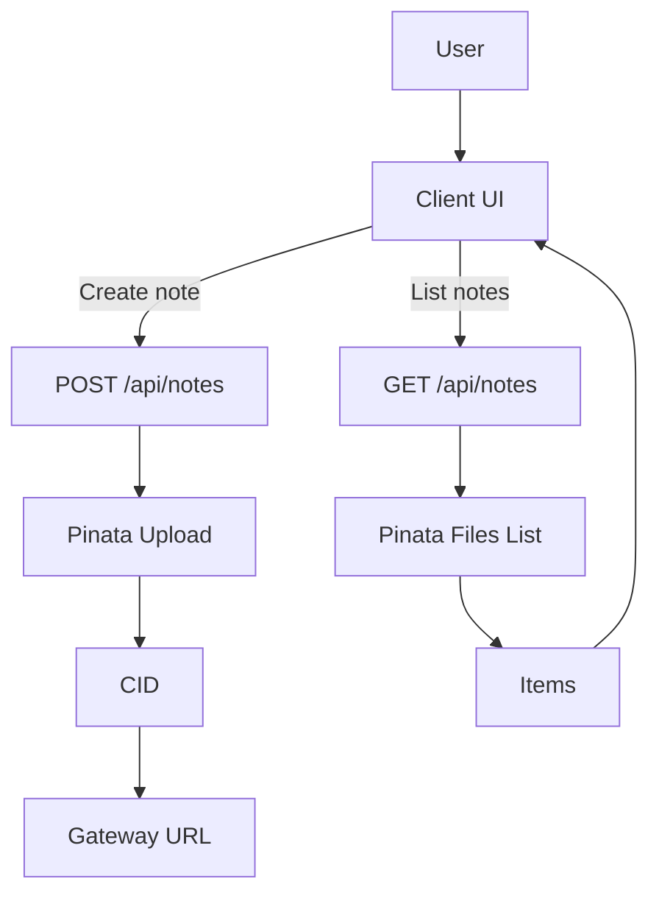

# HashNotes

Decentralized notes on IPFS powered by Pinata. Write, pin, and share via unique CIDs.

- Live demo: https://hashnotes.casaislabs.com

## Table of Contents

- [Overview](#overview)
- [Architecture](#architecture)
- [Live Demo](#live-demo)
- [Screenshot](#screenshot)
- [Quick Start](#quick-start)
- [Environment Variables](#environment-variables)
- [Pinata Setup](#pinata-setup)
- [Usage](#usage)
- [API](#api)
- [Security](#security)
- [Flow](#flow)

## Overview

HashNotes is a Next.js App Router application that lets you create short notes and pin them to IPFS using Pinata. Notes are immediately usable via a public gateway URL and can be listed back on the UI.

## Architecture

- Next.js App Router with server and client components.
- Secure server endpoints:
  - `POST /api/notes` uploads text content to Pinata (IPFS).
  - `GET /api/notes` lists previously pinned notes.
- Proxy with strict Content Security Policy in production (`proxy.ts`).
- Client UI components: `NoteForm`, `NotesList`, `NotePanel`.
- Local cache using `localStorage` merged with server listing after hydration.

## Live Demo

- https://hashnotes.casaislabs.com

## Screenshot



## Quick Start

- Prerequisites:
  - Node.js 18+ and npm
  - Pinata account
- Install dependencies:
  - `npm install`
- Configure environment:
  - Create a `.env` file at the project root with the variables below.
- Run locally:
  - `npm run dev`
- Build and run production:
  - `npm run build`
  - `npm start`

## Environment Variables

Create `hashnotes/.env` with:

```
PINATA_JWT=your_jwt_token
NEXT_PUBLIC_GATEWAY_URL=your-gateway.mypinata.cloud
NEXT_PUBLIC_SITE_URL=https://your-domain.com
NODE_ENV=production
```

- `PINATA_JWT`: Pinata JWT used server-side to authenticate uploads and listings.
- `NEXT_PUBLIC_GATEWAY_URL`: your Pinata gateway subdomain (no protocol).
- `NEXT_PUBLIC_SITE_URL`: the public URL of your site (used for metadata).
- `NODE_ENV`: set to `production` in deployments to enable hardening.

Never commit secrets. Use your platform’s secret manager.

## Pinata Setup

1. Sign up at https://pinata.cloud and verify your account.
2. Create a JWT with minimal permissions:
   - Resources: `org:files:read`, `org:files:write`
   - Gateways: `org:gateways:read` (optional, for conversions)
   - Avoid admin-level scopes.
3. Note your gateway domain (e.g., `your-gateway.mypinata.cloud`) and put it in `NEXT_PUBLIC_GATEWAY_URL`.
4. Paste the JWT into `PINATA_JWT` in `.env`.

Uploads are tagged with `keyvalues { app: "hashnotes" }` for easy filtering.

## Usage

- Create a note in the UI and upload to IPFS.
- The note appears immediately with a CID and a gateway link.
- The list shows only HashNotes-tagged items and merges with your local cache after hydration.

## API

- `POST /api/notes`
  - Body: `multipart/form-data` with `file` (text or JSON, ≤1MB)
  - Returns: `{ cid, url }`
  - Errors: `400` missing file, `413` too large, `415` unsupported type, `429` rate limit, `500` config/error
- `GET /api/notes`
  - Query:
    - `limit` (default 20, max 50)
    - `pageToken` (optional pagination)
  - Returns: `{ items: [{ cid, url, createdAt, text }], nextPageToken }`

## Security

- Content Security Policy (CSP) via `proxy.ts` in production.
- Server-side validation:
  - MIME whitelist: `text/plain`, `application/json`
  - Size limit: 1MB
- Rate limiting per IP:
  - `POST`: 10 requests/minute
  - `GET`: 20 requests/minute
- Error messages are clear and user-facing in the UI.

For horizontal scaling, back the rate limit store with Redis.

## Flow


